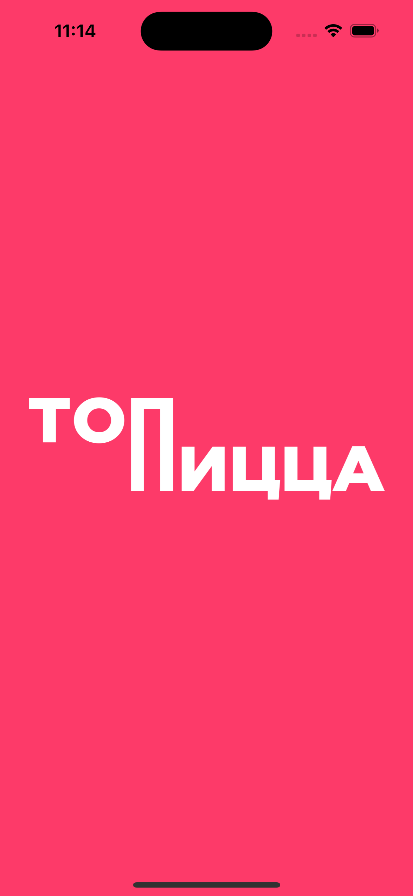
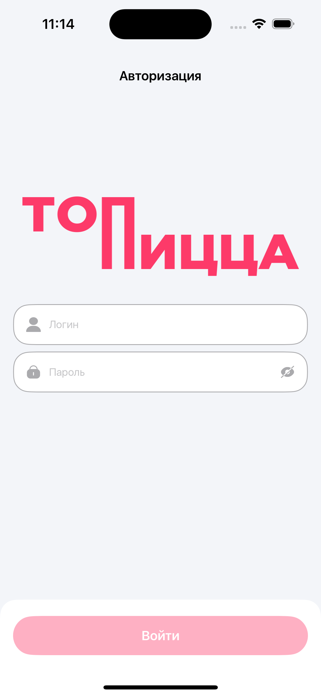
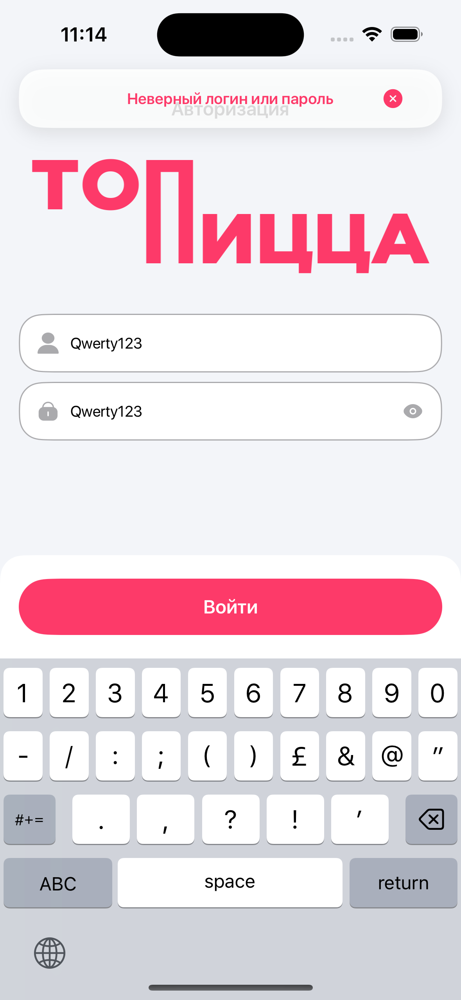
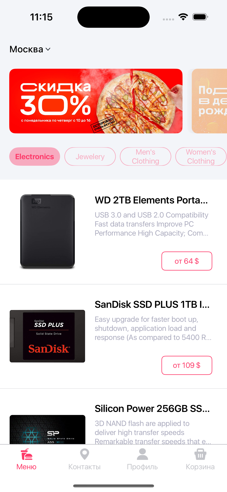
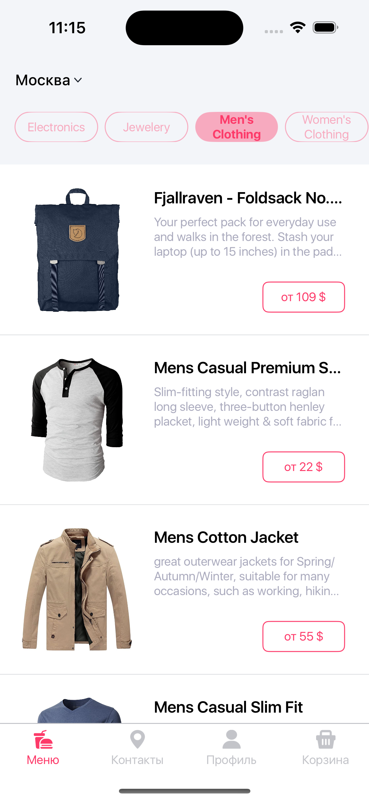
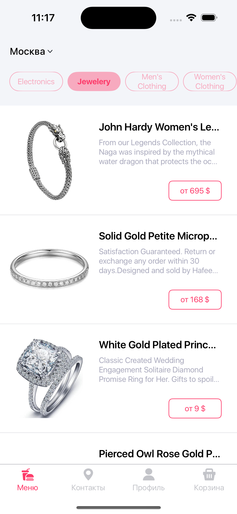

# HammerSystemsFoodDelivery

Тестовое задание для компании **Hammer Systems** по доставке еды, использовал **SwiftUI** и архитектуру **MVP**

## Stack  

- **iOS:** 15.0+  
- **Технологии:** Swift, SwiftUI 
- **Интерфейс:** SwiftUI
- **Архитектура:** MVP 
- **Сетевые запросы:** URLSession 
- **Асинхронность:** Structured Concurrency (async/await)
- **Offline-режим:** FileManager
- **Загрузка изображений:** библиотека Kingfisher (Swift Package Manager)
- **Управление состоянием:** @State, @Binding, @FocusState 

## Features  

- Использовал [Fake Store API](https://fakestoreapi.com/) для загрузки товаров и категорий, так как уже использовал его ранее.
- Релизовал авторизацию и главный экран с функциональностью и все пункты тестового задания, срок реализации 3 дня.
- Использовал те же шрифты, стили, цвета, размеры, расположение из макета figma, проверял на разных моделях iPhone, включая SE, чтобы везде отображалось корректно.
- Уделил внимание перемещению панели с кнопкой войти, загругленности верхних углов, чтобы она плавно выезжала и убиралась вместе с клавиатурой. И так же, чтобы поднимались над клавиатурой логотип, поле логина и пароля. 
- Банер об ошибке ввода или успешном входе, сделал частично прозрачный как в макете с тенью, появляется на время, отображается поверх элементов. 
- Реализовал, чтобы кнопка войти была активна только при заполнении полей, при нажатии показать пароль клавиатура не скрывается. 
- Добавил, чтобы при скролинге товаров отображалась соотвествующая категория, так и при выборе категории, чтобы список пролистывался к соответствующему разделу. 
- Категории прилипают к верхнему краю при скролле, баннеры скрываются.
- Изображения кэшируются через библиотеку Kingfisher.
- Сетевые запросы реализованы с использованием URLSession через URLComponents и ошибок NetworkError.
- Реализовал Dependency Injection для ProductService и CategoryService, с использованием соответствующих протоколов.
- Вынес основные поля в Constants.
- Добавил кастомные шрифты и расширение Color+Hex.
- Сделал кастомный TabBar с изменением цвета иконок и подписей при переключении.
- Offline-режим реализовал с помощью FileManager. Сохраняются последние загруженные товары и категории. Проверял, при отключении интернета загруженные данные отображаются.

## Screenshots  

<table align="center">
  <tr>
    <td></td>
    <td></td>
  </tr>
  <tr>
    <td></td>
    <td></td>
  </tr>
  <tr>
    <td></td>
    <td></td>
  </tr>
    <tr>
    <td></td>
    <td></td>
  </tr>
</table>  

## Installation

1. Клонируйте репозиторий:
```bash
git clone https://github.com/evgenff1/HammerSystemsFoodDelivery.git
```
2. Откройте проект в Xcode (версии 15.2 или выше)

3. Соберите и запустите проект на симуляторе или устройстве с iOS 15+

Для тестирования авторизации используйте:
Username: Qwerty1234
Password: Qwerty1234
